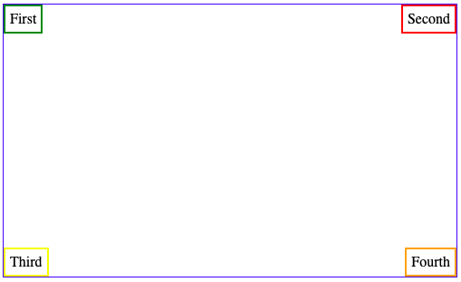
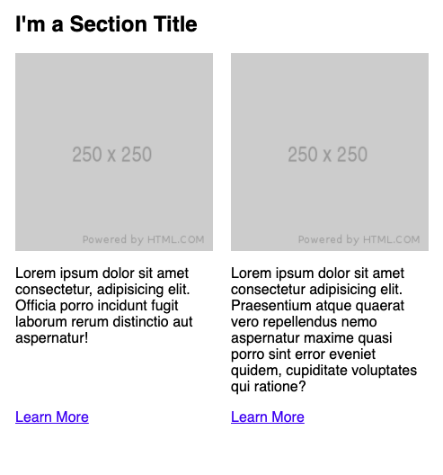
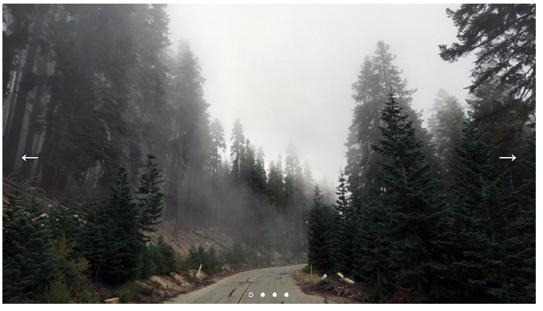

# Junior Front End Developer List of Challenges

## Advice

Before you start doing all the challenges, I recommend you start with the basics. As a Front End Developer I have set up builds using Grunt, Gulp, Broccoli, Webpack, RequireJS. All those build systems are great but some can be challenging to set up, that is why I’m recommending [Parcel](https://parceljs.org/getting_started.html).

It’s easy to set up, self explanatory and I believe it is a good start for Junior developers to understand why we need a build system for each of our projects.

## Development

- Use vanilla Javascript, I repeat use vanilla Javascript.
- Style your components using CSS, SASS or LESS...Oh and DON'T USE Bootstrap or any other CSS Framework. Create you own styles practices, practices, practices.
- Don't forget to create an index.html file
- Publish your work using GitHub Pages, Heroku or Netlify.

**REMEMBER**: Everything needs to be responsive. AND don't forget to use normalize.css or sanitize.css or reset.css

## List

- 4 blocks: Place 4 ```<div>``` elements in every corner of the page.



- Create a Section: With a Section Title, Image, description and link field. Extra point here if you think about Accessibility.



- Create a Carousel: Full-width responsive image slider using vanilla JS.

		- The image slider should loop infinitely
		- The image slider should auto play, unless hovered by user
		- Image slider may use fade or slide transition
		- Think about accessibility (https://www.w3.org/WAI/tutorials/carousels/)



- Create a Quiz: Using a REST API of your choice create a 10 TRUE or FALSE questions and show a results screen with the score, and also add all the questions and whether the answer was correct or not.

		Sample API: https://opentdb.com/api.php?amount=10&difficulty=hard&type=boolean


---> Tag me if you want me to review your code you can find me in Twitter at @vanss472

<a href="https://www.buymeacoffee.com/vanss472" target="_blank"></a>
